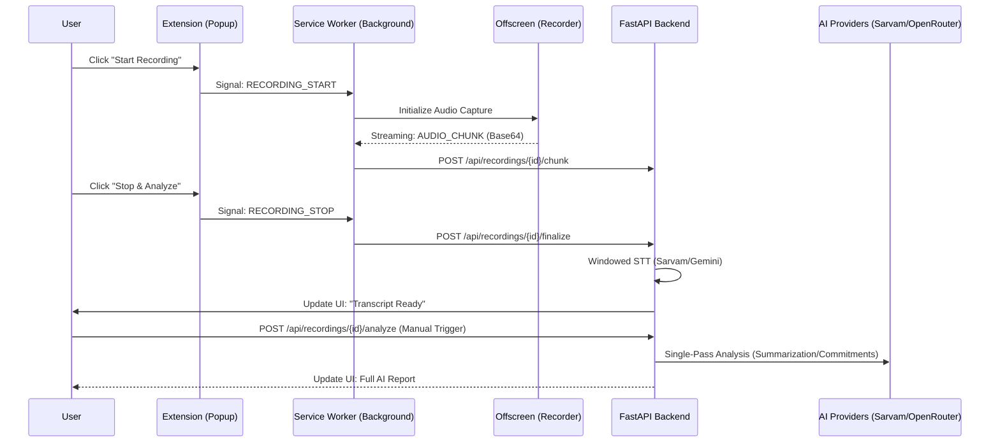

# 🏛️ MeetIQ — Solution Architecture Deep-Dive

## Executive Summary
MeetIQ is an enterprise-grade AI meeting intelligence ecosystem. The architecture is a decoupled, micro-service-oriented design that prioritizes data integrity, low-latency audio capture, and cost-efficient AI reasoning.

---

## 🏗️ High-Level Design Principles

1.  **Client-Side Capture (MV3 & Offscreen)**: Chrome's Manifest V3 restricts background audio capture. We utilize an *Offscreen Document* as a temporary rendering context to handle the `tabCapture` stream and microphone merge via the **Web Audio API**.
2.  **Streaming Ingestion**: Audio is not buffered entirely on the client. It is chunked into 10-second Base64 fragments and streamed via REST POST requests to the backend (`/chunk`). This ensures that even if a tab crashes, historical data is persisted on the server.
3.  **Two-Stage "AI Brain" Execution**: Transcription and Analysis are decoupled. Transcription is automated for speed, while AI Analysis ("The Brain") is manually triggered. This prevents unnecessary token consumption on trivial or accidental recordings.
4.  **Windowed STT Processing**: A custom algorithmic layer that groups multiple chunks into safe "Windows" (20-30s) to bypass provider-specific duration limits (like Sarvam's 30s limit) while maintaining sub-second transcription latency.

---

## 🧩 Component Interaction & Flow

---

## 💾 Engineering Data Models

### **Recording Entity**
The core record that aggregates all interaction metadata.
- `transcript`: The raw text output from the STT provider.
- `summary`: A JSON blob containing `overview`, `key_points`, `decisions`, and `sentiment`.
- `commitments`: A highly structured JSON array of "Risky Promises".
- `action_items`: Actionable tasks with owners and priorities.

### **Chunk Entity**
Each 10-second audio fragment is stored with a `sequence` number to ensure correct ordering during finalization, even in non-contiguous transmission scenarios.

---

## 🧠 Intelligence Orchestration (Service Layer)

### **Transcription Service (`transcription.py`)**
-   **Windowing Logic**: Combines audio bytes, writes to a temporary `NamedTemporaryFile`, and sends to the provider. 
-   **REST Implementation**: We utilize the raw REST API for Sarvam instead of the SDK to ensure full support for the `with_timestamps` and `saaras:v3` parameters.

### **Analysis Service (`ai_analysis.py`)**
-   **Single-Pass Prompting**: Instead of calling the LLM four separate times (Summary, Actions, Commitments, Email), we use a single, comprehensive system prompt. This results in:
    -   **75% reduction** in input token costs.
    -   **60% reduction** in total wait time for the user.
-   **Robust JSON Parsing**: Implements a multi-layered regex and string-manipulation parser to clean responses from smaller models that may include markdown formatting or trailing text.

---

## 🛡️ Security & Privacy Compliance

1.  **CORS & Authentication**: The backend implements strict CORS policies, only allowing requests from specifically configured origins (extension IDs).
2.  **Environment Isolation**: Sensitive keys (Gemini, Sarvam, OpenRouter) are exclusively stored in the backend environment as secrets, never exposed to the client-side extension.
3.  **Data Persistence**: Primary data is stored in **PostgreSQL** (Production) or **SQLite** (Local Dev), ensuring full transaction safety for meeting records.
4.  **Local History Sync**: The extension synchronizes its local `chrome.storage` cache with the backend once analysis is finalized, providing a fast, offline-capable browsing experience for past meetings.

---

## 📈 Future Scalability Path

-   **Diarization Engine**: Integrating Pyannote or AssemblyAI for multi-speaker recognition.
-   **Real-time Alerts**: Pushing commitment notifications directly to Slack/Teams in real-time during the call via Webhooks.
-   **Knowledge Base Integration**: Feeding summarized meetings into a RAG (Retrieval-Augmented Generation) pipeline for cross-meeting intelligence.

---

*MeetIQ Solution Architecture — Professional Grade Meeting Intelligence.*
