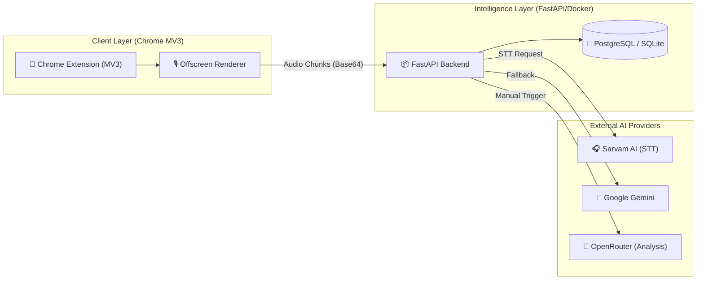

# 🧠 MeetIQ — AI-Driven Meeting Intelligence Engine

MeetIQ is a high-performance Chrome Extension and Backend ecosystem designed to automate the lifecycle of meeting documentation. By capturing, transcribing, and analyzing multi-party conversations, it transforms raw audio into structured, actionable intelligence.


---

## 🏛️ System Architecture & Design

As a modular solution, MeetIQ separates the concerns of audio ingestion, real-time transcription, and asynchronous AI analysis. The following diagram illustrates the secure data orchestration flow:



### 💎 Solution Pillars

1.  **Low-Latency Ingestion**: Utilizing a specialized *Offscreen Document* in Chrome, we capture high-quality tab and microphone audio with zero overhead.
2.  **Multilingual Transcription**: Integrated with **Sarvam Saaras v3**, providing specialized speech-to-text for English and 22 Indian languages.
3.  **Two-Stage "AI Brain" Analysis**: A cost-efficient workflow where transcription is immediate, and deep analysis is triggered manually to optimize token consumption.
4.  **Deterministic Commitment Detection**: Specialized prompting to identify "High Risk" promises, budget mentions, and timelines.

---

## 🚀 Business Value

-   **Focus on Presence**: Eliminate manual note-taking and focus on the stakeholder conversation.
-   **Risk Mitigation**: Instantly detect and flag high-risk commitments (e.g., specific deadlines or cost estimates).
-   **Automated Continuity**: Generate professional follow-up emails and action items immediately after the meeting ends.

---

## 🛠️ Technical Implementation

### **Hybrid Recording Pipeline**
The system merges system audio and mic into a single high-fidelity WebM stream. This is then streamed to the backend in 10-second base64 encoded chunks to ensure reliability across long meetings.

### **Windowed Post-Processing**
To bypass provider-specific limitations (like Sarvam's 30s limit), the backend implements a **Windowed Processing Service**. This logic groups audio chunks into safe 20s windows, transcribes them in parallel, and re-sequences the results with millisecond-accurate offsets.

---

## 🏁 Deployment Workflow

### 1. Backend Orchestration
The backend is dockerized for consistent environment parity.
```powershell
# Deploy the containerized API
docker-compose up -d --build
```

### 2. Extension Lifecycle
1.  Load the `extension/` folder as an "Unpacked Extension" in Chrome.
2.  Configure your `API_URL` and `SpeakerName` in the settings tab.
3.  Begin capturing intelligence from Google Meet, Teams, or Zoom.

---

## 📖 Key Documentation
-   **[DEVELOPER_SETUP.md](file:///d:/workspace/MeetIQ/DEVELOPER_SETUP.md)**: Standard operating procedures for local development and debugging.
-   **[ARCHITECTURE.md](file:///d:/workspace/MeetIQ/ARCHITECTURE.md)**: Deep-dive into data models, security protocols, and STT/LLM orchestration.

Designed for the modern, high-velocity workforce.
