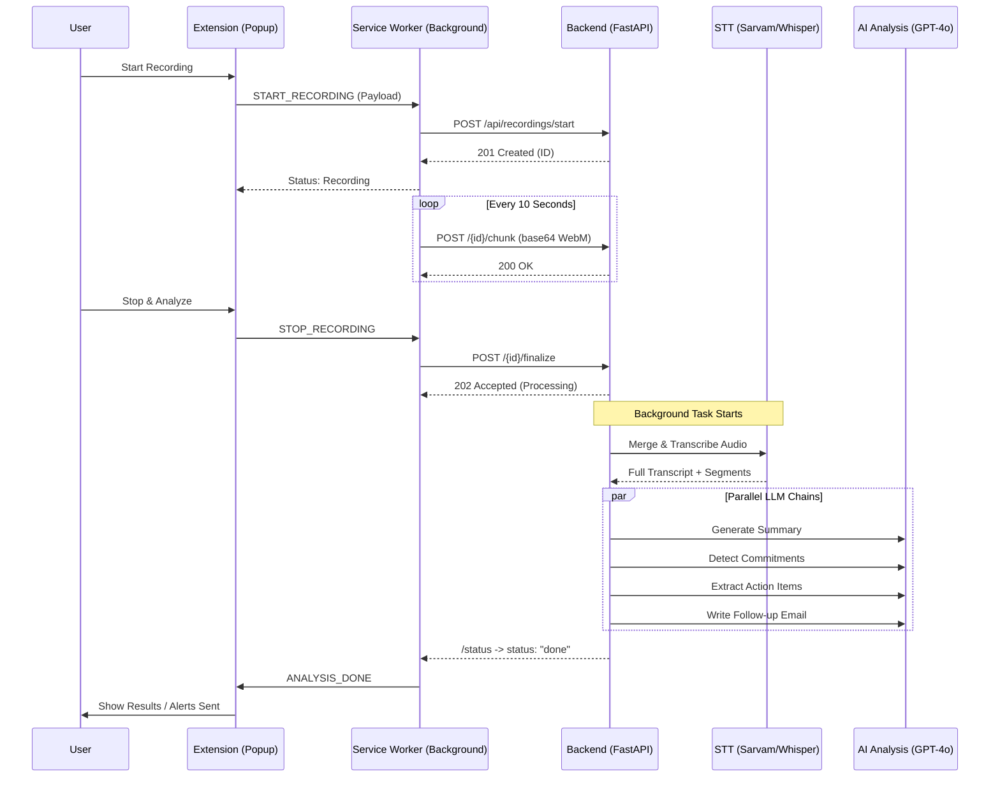

# MeetIQ Core System Flow Charts

## Recording Sequence Diagram (Capture & Sync)



## System Deployment Overview

```mermaid
graph LR
    subgraph Client
        CE[Chrome Extension (MV3)]
        OS[Offscreen Renderer]
    end
    
    subgraph Infrastructure
        BE[FastAPI Backend]
        DB[(SQLite / Postgres)]
    end
    
    subgraph External_APIs
        OAI[OpenAI (Whisper/GPT-4o)]
        GMN[Google Gemini]
        SVA[Sarvam AI]
    end
    
    CE --> OS
    OS -- Audio Stream --> BE
    BE --> DB
    BE --> OAI
    BE --> GMN
    BE --> SVA
```
