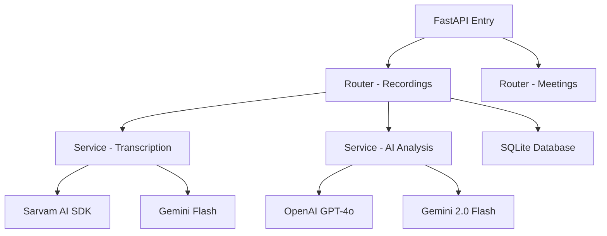

# MeetIQ System & Solution Architecture

MeetIQ is a high-performance meeting intelligence platform that combines browser-level audio capture with a scalable backend for real-time transcription and AI-driven analysis.

## High-Level Solution Overview

The system is designed as a **Micro-Frontend** (Chrome Extension) communicating with an **Aggregator Backend** (FastAPI).

### Key Components

- **Client Layer**: Chrome Extension built with Manifest V3.
- **Capture Engine**: Web Audio API + `tabCapture` for merging system and microphone audio.
- **Storage Layer**: Chrome local storage for local state; SQLite (WAL mode) for persistent backend storage.
- **Analysis Engine**: Multi-chain LLM processing (GPT-4o/Gemini) and specialized STT (Sarvam AI/Whisper).

## Application Architecture (Backend)

The backend follows a **Service-Router** pattern to ensure clear separation of concerns.

### Data Flow (Capture to Insight)

1.  **Ingestion**: Extension captures audio in 10-second base64 WebM chunks.
2.  **Streaming**: Chunks are POSTed to `/{id}/chunk`.
3.  **Finalization**: When the meeting ends, a background process:
    -   Merges WebM chunks in memory/temp file.
    -   Triggers specialized STT (e.g., Saaras v3 for Indian languages).
    -   Splits transcript into 4 parallel AI processing chains (Summary, Commitments, Action Items, Email).
4.  **Delivery**: Results are stored in DB and pushed to Discord/Slack via webhook.

## Technical Best Practices Implemented

- **Concurrency**: Enabled SQLite WAL (Write-Ahead Logging) to allow simultaneous read/write during heavy background analysis.
- **Reliability**: Self-healing service worker in the extension; marks interrupted recordings as 'error' on browser restart.
- **Speed**: Uses Gemini 2.0 Flash for parallel analysis to minimize user wait time.
- **Privacy**: No audio stored permanently on disk after processing completes.

## Security Considerations

- **API Keys**: Stored as environment variables, never committed to VCS (enforced by `.gitignore`).
- **Data at Rest**: SQLite database is local to the container/server.
- **Authentication**: Uses internal storage tokens for session state management.
